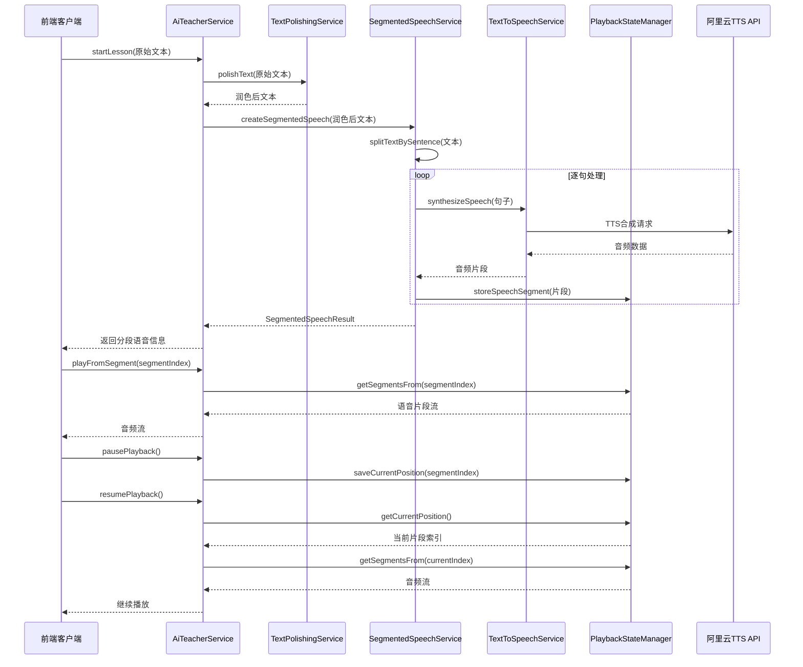
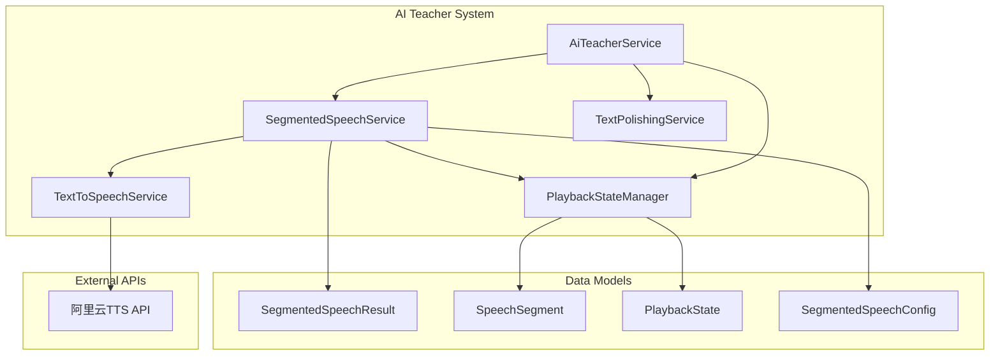

# 设计文档

## 概述

本设计文档描述了如何扩展现有的AI老师系统，实现分段语音合成和播放控制功能。在文本润色完成后，系统将按句号分割文本，逐句进行TTS合成，并管理每个语音片段的播放状态，支持中断后从当前位置继续播放。

### 设计目标

1. 扩展现有的`AiTeacherService`，增加分段语音合成功能
2. 实现语音片段的状态管理和播放控制
3. 支持播放中断和恢复功能
4. 保持现有API接口的兼容性
5. 提供高效的内存管理和流式处理

## 架构

### 整体流程架构



### 组件架构



## 组件和接口

### 1. SegmentedSpeechService (新增)

**职责：** 负责文本分句、逐句TTS合成和语音片段管理

**核心方法：**
```java
public class SegmentedSpeechService {
    // 创建分段语音
    public Mono<SegmentedSpeechResult> createSegmentedSpeech(String text);
    
    // 按句号分割文本
    public List<String> splitTextBySentence(String text);
    
    // 批量合成语音片段
    public Flux<SpeechSegment> synthesizeSegments(List<String> sentences);
    
    // 获取指定范围的语音片段
    public Flux<SpeechSegment> getSegmentsRange(String sessionId, int startIndex, int endIndex);
    
    // 清理会话数据
    public Mono<Void> cleanupSession(String sessionId);
}
```

**关键特性：**
- 智能文本分句（支持中英文句号）
- 流式TTS合成，避免内存溢出
- 语音片段缓存管理
- 会话级别的数据隔离

### 2. PlaybackStateManager (新增)

**职责：** 管理播放状态和语音片段存储

**核心方法：**
```java
public class PlaybackStateManager {
    // 存储语音片段
    public Mono<Void> storeSpeechSegment(String sessionId, SpeechSegment segment);
    
    // 获取指定片段
    public Mono<SpeechSegment> getSegment(String sessionId, int segmentIndex);
    
    // 获取从指定位置开始的所有片段
    public Flux<SpeechSegment> getSegmentsFrom(String sessionId, int startIndex);
    
    // 保存播放位置
    public Mono<Void> savePlaybackPosition(String sessionId, int segmentIndex);
    
    // 获取当前播放位置
    public Mono<Integer> getCurrentPlaybackPosition(String sessionId);
    
    // 获取播放状态
    public Mono<PlaybackState> getPlaybackState(String sessionId);
    
    // 清理会话数据
    public Mono<Void> cleanupSession(String sessionId);
}
```

**关键特性：**
- 内存高效的片段存储
- 播放位置持久化
- 自动内存清理机制
- 并发安全的状态管理

### 3. AiTeacherService (扩展)

**扩展内容：**
- 添加分段语音合成方法
- 集成播放控制功能
- 保持向后兼容性

**新增方法：**
```java
public class AiTeacherService {
    // 创建分段语音课程
    public Mono<SegmentedLessonResult> startSegmentedLesson(String lessonContent);
    
    // 从指定片段开始播放
    public Flux<byte[]> playFromSegment(String sessionId, int segmentIndex);
    
    // 暂停播放
    public Mono<Void> pausePlayback(String sessionId, int currentSegmentIndex);
    
    // 恢复播放
    public Flux<byte[]> resumePlayback(String sessionId);
    
    // 获取播放进度
    public Mono<PlaybackProgress> getPlaybackProgress(String sessionId);
    
    // 跳转到指定片段
    public Flux<byte[]> seekToSegment(String sessionId, int segmentIndex);
}
```

### 4. SegmentedSpeechConfig (新增)

**职责：** 管理分段语音的配置参数

**配置项：**
```yaml
segmented-speech:
  enabled: true
  sentence-separators: ["。", "！", "？", ".", "!", "?"]
  max-segment-length: 200
  max-concurrent-synthesis: 3
  segment-cache-size: 50
  session-timeout: 30m
  memory-cleanup-interval: 5m
  enable-preload: true
  preload-segments: 2
```

## 数据模型

### 1. SpeechSegment

```java
@Data
public class SpeechSegment {
    private int segmentIndex;        // 片段索引
    private String text;             // 原始文本
    private byte[] audioData;        // 音频数据
    private long duration;           // 音频时长（毫秒）
    private LocalDateTime createdAt; // 创建时间
    private boolean isPreloaded;     // 是否预加载
    private String checksum;         // 音频数据校验和
}
```

### 2. SegmentedSpeechResult

```java
@Data
public class SegmentedSpeechResult {
    private String sessionId;           // 会话ID
    private int totalSegments;          // 总片段数
    private List<String> segmentTexts;  // 各片段文本
    private long totalDuration;         // 预估总时长
    private LocalDateTime createdAt;    // 创建时间
    private boolean isComplete;         // 是否完全合成
    private String status;              // 状态信息
}
```

### 3. PlaybackState

```java
@Data
public class PlaybackState {
    private String sessionId;          // 会话ID
    private int currentSegmentIndex;   // 当前播放片段索引
    private int totalSegments;         // 总片段数
    private PlaybackStatus status;     // 播放状态
    private LocalDateTime lastUpdated; // 最后更新时间
    private long playedDuration;       // 已播放时长
    private long totalDuration;        // 总时长
}
```

### 4. PlaybackProgress

```java
@Data
public class PlaybackProgress {
    private int currentSegment;        // 当前片段
    private int totalSegments;         // 总片段数
    private double progressPercentage; // 进度百分比
    private String currentText;        // 当前片段文本
    private long remainingDuration;    // 剩余时长
    private PlaybackStatus status;     // 播放状态
}
```

### 5. SegmentedLessonResult

```java
@Data
public class SegmentedLessonResult {
    private String sessionId;          // 会话ID
    private int totalSegments;         // 总片段数
    private List<String> segmentTexts; // 片段文本列表
    private String firstSegmentAudio;  // 第一个片段的音频（Base64）
    private PlaybackProgress progress; // 播放进度信息
    private boolean isReady;           // 是否准备就绪
}
```

## 错误处理

### 1. 错误分类和处理策略

| 错误类型 | 处理策略 | 用户体验 |
|---------|---------|---------|
| 文本分句失败 | 使用简单分割策略 | 降级处理，不影响功能 |
| TTS合成失败 | 重试单个片段，记录失败 | 跳过失败片段，继续播放 |
| 内存不足 | 清理旧片段，限制并发 | 自动内存管理 |
| 会话超时 | 自动清理过期数据 | 提示用户重新开始 |
| 播放状态丢失 | 从头开始播放 | 提示用户播放位置重置 |

### 2. 降级机制

```java
public Mono<SegmentedSpeechResult> createSegmentedSpeechWithFallback(String text) {
    return createSegmentedSpeech(text)
        .onErrorResume(error -> {
            log.warn("分段语音合成失败，降级到普通合成: {}", error.getMessage());
            // 降级到原有的单段合成
            return textToSpeechService.synthesizeSpeech(text)
                .map(audioData -> createFallbackResult(text, audioData));
        });
}
```

## 测试策略

### 1. 单元测试

**SegmentedSpeechService测试：**
- 文本分句功能测试
- 语音片段合成测试
- 内存管理测试
- 并发处理测试

**PlaybackStateManager测试：**
- 状态存储和检索测试
- 播放位置管理测试
- 会话清理测试
- 并发安全测试

### 2. 集成测试

**端到端流程测试：**
- 完整的分段语音创建流程
- 播放控制功能测试
- 中断和恢复功能测试
- 多会话并发测试

**性能测试：**
- 大文本分段处理性能
- 内存使用情况监控
- TTS并发合成性能
- 播放响应时间测试

### 3. 压力测试

**负载测试：**
- 多用户并发使用
- 长文本处理能力
- 内存泄漏检测
- 系统稳定性验证

## 配置管理

### 1. 应用配置文件

**application.yml 新增配置：**
```yaml
# 分段语音配置
segmented-speech:
  enabled: true
  
  # 文本分句配置
  text-splitting:
    sentence-separators: ["。", "！", "？", ".", "!", "?"]
    max-segment-length: 200
    min-segment-length: 5
    smart-splitting: true
    
  # TTS合成配置
  synthesis:
    max-concurrent-requests: 3
    retry-attempts: 2
    timeout: 10s
    batch-size: 5
    
  # 缓存配置
  cache:
    segment-cache-size: 50
    session-timeout: 30m
    enable-preload: true
    preload-segments: 2
    
  # 内存管理配置
  memory:
    cleanup-interval: 5m
    max-memory-usage: 100MB
    auto-cleanup-enabled: true
    
  # 播放控制配置
  playback:
    enable-seek: true
    enable-pause-resume: true
    progress-update-interval: 1s
```

### 2. 配置类

```java
@ConfigurationProperties(prefix = "segmented-speech")
@Data
public class SegmentedSpeechProperties {
    private boolean enabled = true;
    private TextSplitting textSplitting = new TextSplitting();
    private Synthesis synthesis = new Synthesis();
    private Cache cache = new Cache();
    private Memory memory = new Memory();
    private Playback playback = new Playback();
    
    @Data
    public static class TextSplitting {
        private List<String> sentenceSeparators = Arrays.asList("。", "！", "？", ".", "!", "?");
        private int maxSegmentLength = 200;
        private int minSegmentLength = 5;
        private boolean smartSplitting = true;
    }
    
    @Data
    public static class Synthesis {
        private int maxConcurrentRequests = 3;
        private int retryAttempts = 2;
        private Duration timeout = Duration.ofSeconds(10);
        private int batchSize = 5;
    }
    
    @Data
    public static class Cache {
        private int segmentCacheSize = 50;
        private Duration sessionTimeout = Duration.ofMinutes(30);
        private boolean enablePreload = true;
        private int preloadSegments = 2;
    }
    
    @Data
    public static class Memory {
        private Duration cleanupInterval = Duration.ofMinutes(5);
        private String maxMemoryUsage = "100MB";
        private boolean autoCleanupEnabled = true;
    }
    
    @Data
    public static class Playback {
        private boolean enableSeek = true;
        private boolean enablePauseResume = true;
        private Duration progressUpdateInterval = Duration.ofSeconds(1);
    }
}
```

## 监控和日志

### 1. 日志策略

**关键日志点：**
- 文本分句结果
- TTS合成进度
- 播放状态变化
- 内存使用情况
- 错误和异常

**日志格式：**
```
[SEGMENTED_SPEECH] sessionId={} | action={} | segmentIndex={} | totalSegments={} | duration={}ms | status={}
```

### 2. 监控指标

**业务指标：**
- 分段合成成功率
- 平均片段合成时间
- 播放中断频率
- 用户播放完成率

**技术指标：**
- 内存使用量
- TTS并发请求数
- 缓存命中率
- 会话活跃数量

## 部署考虑

### 1. 性能优化

- TTS请求连接池优化
- 语音片段内存池管理
- 异步处理优化
- 缓存策略优化

### 2. 扩展性设计

- 支持分布式部署
- 状态数据外部存储
- 负载均衡支持
- 水平扩展能力

### 3. 安全考虑

- 会话数据隔离
- 内存数据清理
- 访问权限控制
- 数据传输安全