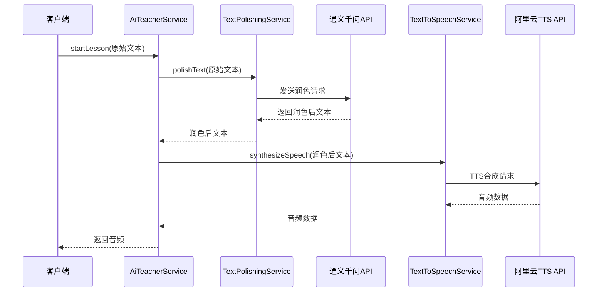
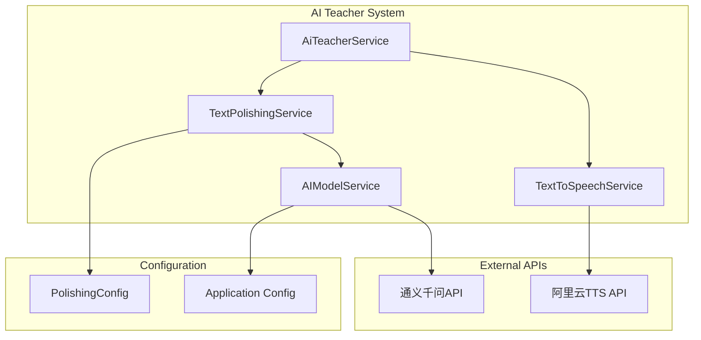

# 设计文档

## 概述

本设计文档描述了如何在现有的AI老师系统中集成文本润色功能。通过在TTS语音合成之前添加通义千问文本润色步骤，系统将能够将原始讲课文本优化为更适合教学场景的内容。

### 设计目标

1. 在现有的`AiTeacherService.startLesson()`方法中集成文本润色功能
2. 保持现有API接口不变，确保向后兼容
3. 提供可配置的润色策略和降级机制
4. 确保系统性能和可靠性

## 架构

### 整体流程架构



### 组件架构



## 组件和接口

### 1. TextPolishingService (新增)

**职责：** 负责调用通义千问API对文本进行润色处理

**核心方法：**
```java
public class TextPolishingService {
    // 主要润色方法
    public Mono<String> polishText(String originalText);
    
    // 带超时的润色方法
    public Mono<String> polishTextWithTimeout(String originalText, Duration timeout);
    
    // 检查服务可用性
    public Mono<Boolean> isServiceAvailable();
}
```

**关键特性：**
- 支持超时控制（默认5秒）
- 自动降级机制（API不可用时返回原文）
- 可配置的润色提示词
- 请求和响应日志记录

### 2. PolishingConfig (新增)

**职责：** 管理文本润色的配置参数

**配置项：**
```yaml
text-polishing:
  enabled: true
  timeout: 5s
  prompt: "请将以下文本润色为适合老师讲课的内容，保持原意的同时使语言更加生动、易懂，适合口语化表达："
  fallback-enabled: true
  max-text-length: 500
```

### 3. AiTeacherService (修改)

**修改内容：**
- 在`startLesson()`方法中集成文本润色步骤
- 添加润色功能的开关控制
- 保持原有接口签名不变

**修改后的流程：**
```java
public Mono<byte[]> startLesson(String lessonContent) {
    return textPolishingService.polishText(lessonContent)
        .flatMap(polishedText -> ttsService.synthesizeSpeech(polishedText));
}
```

### 4. AIModelService (扩展)

**扩展内容：**
- 添加专门用于文本润色的方法
- 支持不同的提示词模板
- 优化错误处理和重试机制

## 数据模型

### 1. TextPolishingRequest

```java
@Data
public class TextPolishingRequest {
    private String originalText;      // 原始文本
    private String polishingPrompt;   // 润色提示词
    private Integer maxLength;        // 最大长度限制
    private String requestId;         // 请求ID（用于日志追踪）
}
```

### 2. TextPolishingResponse

```java
@Data
public class TextPolishingResponse {
    private String polishedText;      // 润色后文本
    private String originalText;      // 原始文本
    private boolean isPolished;       // 是否成功润色
    private String errorMessage;      // 错误信息（如果有）
    private long processingTimeMs;    // 处理耗时
}
```

### 3. PolishingMetrics

```java
@Data
public class PolishingMetrics {
    private int originalLength;       // 原始文本长度
    private int polishedLength;       // 润色后文本长度
    private long apiResponseTime;     // API响应时间
    private boolean fallbackUsed;     // 是否使用了降级
    private String requestId;         // 请求ID
}
```

## 错误处理

### 1. 错误分类和处理策略

| 错误类型 | 处理策略 | 用户体验 |
|---------|---------|---------|
| API超时 | 使用原始文本继续流程 | 无感知降级 |
| API不可用 | 使用原始文本继续流程 | 无感知降级 |
| 文本过长 | 截断后润色或直接使用原文 | 记录警告日志 |
| 配置错误 | 禁用润色功能 | 使用原始文本 |
| 网络异常 | 重试1次，失败后降级 | 无感知降级 |

### 2. 降级机制

```java
public Mono<String> polishTextWithFallback(String originalText) {
    if (!polishingConfig.isEnabled()) {
        return Mono.just(originalText);
    }
    
    return polishText(originalText)
        .timeout(Duration.ofSeconds(polishingConfig.getTimeoutSeconds()))
        .onErrorReturn(originalText)  // 任何错误都降级到原文
        .doOnError(error -> log.warn("文本润色失败，使用原文: {}", error.getMessage()));
}
```

## 测试策略

### 1. 单元测试

**TextPolishingService测试：**
- 正常润色流程测试
- 超时处理测试
- API异常处理测试
- 配置参数验证测试

**AiTeacherService集成测试：**
- 润色功能开启/关闭测试
- 端到端流程测试
- 性能基准测试

### 2. 集成测试

**API集成测试：**
- 通义千问API连接测试
- 不同文本长度的润色测试
- 并发请求处理测试

**配置测试：**
- 配置文件加载测试
- 动态配置更新测试
- 默认配置验证测试

### 3. 性能测试

**响应时间测试：**
- 润色API响应时间测量
- 端到端流程耗时测量
- 超时机制验证

**负载测试：**
- 并发润色请求处理
- 内存使用情况监控
- API限流处理测试

## 配置管理

### 1. 应用配置文件

**application.yml 新增配置：**
```yaml
# 文本润色配置
text-polishing:
  enabled: true
  timeout: 5
  max-retries: 1
  prompt: |
    请将以下文本润色为适合老师讲课的内容，要求：
    1. 保持原意不变
    2. 语言更加生动、易懂
    3. 适合口语化表达
    4. 增加适当的过渡词和解释
    
    原文：
  fallback:
    enabled: true
    use-original-on-error: true
  validation:
    max-text-length: 500
    min-text-length: 5
```

### 2. 配置类

```java
@ConfigurationProperties(prefix = "text-polishing")
@Data
public class TextPolishingProperties {
    private boolean enabled = true;
    private int timeout = 5;
    private int maxRetries = 1;
    private String prompt;
    private Fallback fallback = new Fallback();
    private Validation validation = new Validation();
    
    @Data
    public static class Fallback {
        private boolean enabled = true;
        private boolean useOriginalOnError = true;
    }
    
    @Data
    public static class Validation {
        private int maxTextLength = 500;
        private int minTextLength = 5;
    }
}
```

## 监控和日志

### 1. 日志策略

**关键日志点：**
- 润色请求开始和结束
- API调用成功/失败
- 降级机制触发
- 性能指标记录

**日志格式：**
```
[POLISHING] requestId={} | action={} | originalLength={} | polishedLength={} | duration={}ms | status={}
```

### 2. 监控指标

**业务指标：**
- 润色成功率
- 平均响应时间
- 降级触发频率
- 文本长度变化统计

**技术指标：**
- API调用次数
- 错误率统计
- 超时次数
- 内存使用情况

## 部署考虑

### 1. 配置管理

- 支持环境变量覆盖配置
- 提供配置验证机制
- 支持热更新（通过Spring Boot Actuator）

### 2. 性能优化

- 连接池配置优化
- 请求缓存机制（可选）
- 异步处理优化

### 3. 安全考虑

- API密钥安全存储
- 请求内容脱敏日志
- 访问频率限制