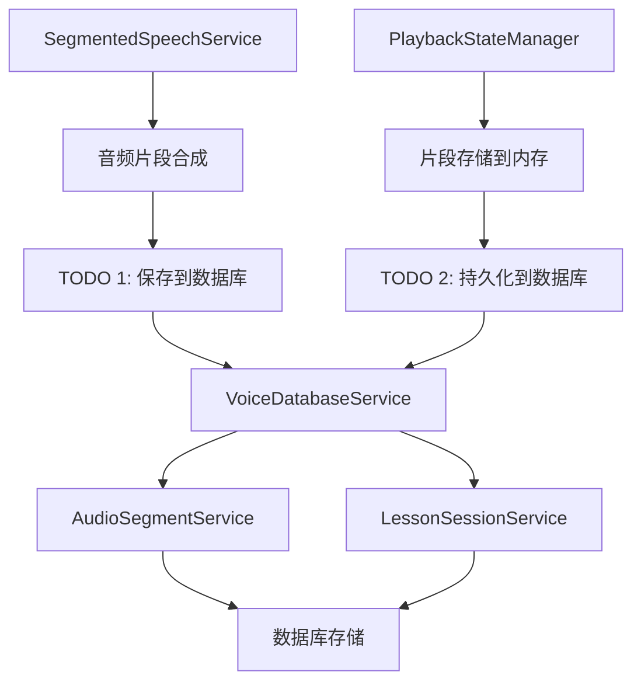
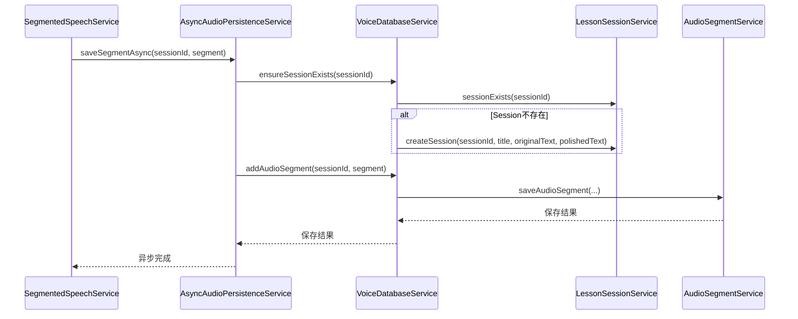

# Design Document

## Overview

本设计文档描述了如何在现有的两个TODO位置实现音频数据的数据库持久化功能。设计采用异步非阻塞的方式，确保数据库操作不影响音频播放的实时性，同时保持现有的内存缓存机制以提供最佳的用户体验。

## Architecture

### 整体架构设计



### 数据流设计

1. **SegmentedSpeechService流程**：
   - 音频合成完成 → 创建SpeechSegment对象 → 异步保存到数据库 → 继续内存存储流程

2. **PlaybackStateManager流程**：
   - 接收SpeechSegment → 存储到内存缓存 → 异步持久化到数据库 → 更新访问时间

## Components and Interfaces

### 1. 数据转换组件

**SpeechSegmentConverter**
- 负责将SpeechSegment DTO转换为AudioSegment实体
- 处理数据格式转换和校验

```java
public class SpeechSegmentConverter {
    public static AudioSegment toAudioSegment(String sessionId, SpeechSegment segment);
    public static List<AudioSegment> toAudioSegmentList(String sessionId, List<SpeechSegment> segments);
}
```

### 2. 异步保存服务

**AsyncAudioPersistenceService**
- 提供异步的音频数据持久化功能
- 处理批量保存和错误重试机制

```java
@Service
public class AsyncAudioPersistenceService {
    public Mono<Void> saveSegmentAsync(String sessionId, SpeechSegment segment);
    public Mono<Void> saveBatchSegmentsAsync(String sessionId, List<SpeechSegment> segments);
    public Mono<Void> ensureSessionExists(String sessionId, String originalText);
}
```

### 3. 修改现有服务

**SegmentedSpeechService修改**
- 在TODO 1位置添加异步数据库保存逻辑
- 注入AsyncAudioPersistenceService依赖

**PlaybackStateManager修改**
- 在TODO 2位置添加持久化逻辑
- 保持现有内存存储机制不变

## Data Models

### SpeechSegment到AudioSegment的映射

| SpeechSegment字段 | AudioSegment字段 | 转换逻辑 |
|------------------|------------------|----------|
| segmentIndex | segmentIndex | 直接映射 |
| text | textContent | 直接映射 |
| audioData | audioData | 直接映射 |
| duration | duration | 直接映射 |
| audioFormat | audioFormat | 直接映射 |
| sampleRate | sampleRate | 直接映射 |
| checksum | checksum | 直接映射 |
| createdAt | createdAt | 直接映射 |
| - | sessionId | 从方法参数获取 |
| - | audioSize | 从audioData.length计算 |

### 会话管理数据流



## Error Handling

### 错误处理策略

1. **数据库连接失败**
   - 记录错误日志
   - 继续使用内存缓存
   - 不影响音频播放功能

2. **数据保存失败**
   - 记录详细错误信息
   - 尝试重试机制（最多3次）
   - 失败后降级到仅内存存储

3. **数据转换错误**
   - 验证数据完整性
   - 记录数据异常日志
   - 跳过异常数据继续处理

### 错误恢复机制

```java
public Mono<Void> saveWithRetry(String sessionId, SpeechSegment segment) {
    return saveSegmentAsync(sessionId, segment)
        .retry(3)
        .onErrorResume(error -> {
            log.error("Failed to save segment after retries: {}", error.getMessage());
            return Mono.empty(); // 不阻塞主流程
        });
}
```

## Testing Strategy

### 单元测试

1. **SpeechSegmentConverter测试**
   - 测试数据转换的正确性
   - 测试边界条件和异常情况

2. **AsyncAudioPersistenceService测试**
   - 测试异步保存功能
   - 测试错误处理和重试机制

3. **集成测试**
   - 测试完整的数据保存流程
   - 测试数据库操作的事务性

### 性能测试

1. **并发保存测试**
   - 测试多个会话同时保存的性能
   - 验证数据库连接池的使用效率

2. **大数据量测试**
   - 测试大音频文件的保存性能
   - 验证内存使用情况

### 集成测试场景

1. **正常流程测试**
   - 创建会话 → 生成音频片段 → 验证数据库保存
   - 验证内存缓存和数据库数据的一致性

2. **异常情况测试**
   - 数据库不可用时的降级处理
   - 网络中断时的重试机制

## Implementation Details

### 配置参数

```yaml
audio:
  persistence:
    enabled: true
    async: true
    retry:
      maxAttempts: 3
      backoffDelay: 1000
    batch:
      enabled: true
      size: 10
```

### 依赖注入

```java
@Service
@RequiredArgsConstructor
public class SegmentedSpeechService {
    private final VoiceDatabaseService voiceDatabaseService;
    private final AsyncAudioPersistenceService persistenceService;
    // ... 其他依赖
}

@Service
@RequiredArgsConstructor  
public class PlaybackStateManager {
    private final VoiceDatabaseService voiceDatabaseService;
    private final AsyncAudioPersistenceService persistenceService;
    // ... 其他依赖
}
```

### 性能优化

1. **批量保存优化**
   - 当有多个片段时，使用批量保存接口
   - 减少数据库连接次数

2. **异步处理优化**
   - 使用Reactor的异步机制
   - 避免阻塞主线程

3. **内存管理优化**
   - 及时释放大音频数据的内存引用
   - 使用弱引用缓存机制