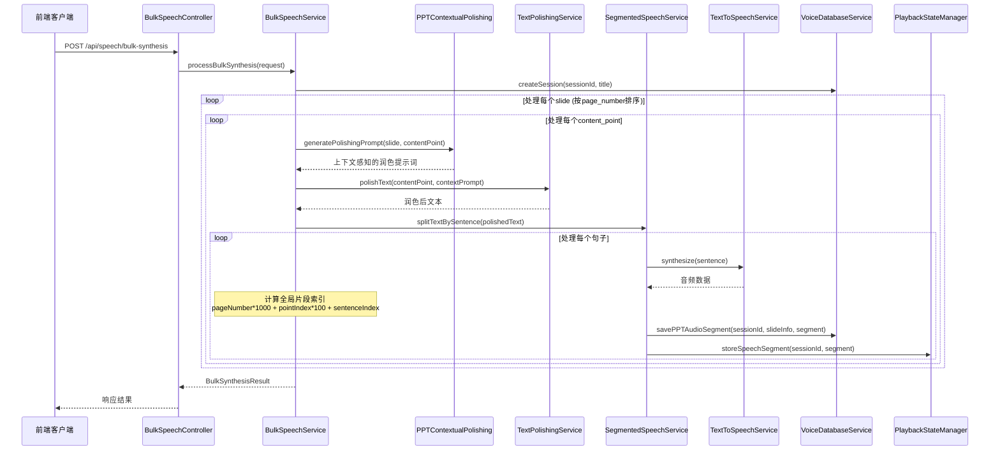

# 设计文档

## 概述

本设计文档描述了如何实现批量语音合成接口，该接口接收完整的讲课大纲JSON数据，利用现有的语音合成服务组件进行分段处理，并将生成的音频数据保存到数据库中。设计采用异步处理模式，确保大批量数据处理的性能和稳定性。

### 设计目标

1. 创建新的Controller接口处理批量语音合成请求
2. 复用现有的SegmentedSpeechService、TextToSpeechService等组件
3. 实现异步批量处理机制，提供进度反馈
4. 确保数据完整性和错误处理机制
5. 提供标准化的API响应格式

## 架构

### 整体流程架构



### 数据流设计

1. **请求处理流程**：
   - 接收JSON请求 → 验证数据格式 → 创建会话 → 异步处理slides

2. **批量合成流程**：
   - 遍历slides数组 → 处理每个content_point → 分句合成 → 保存到数据库

3. **进度跟踪流程**：
   - 初始化进度状态 → 更新处理进度 → 记录完成状态

## 组件和接口

### 1. 控制器层

**BulkSpeechController**
```java
@RestController
@RequestMapping("/api/speech")
@RequiredArgsConstructor
@Slf4j
public class BulkSpeechController {
    
    @PostMapping("/bulk-synthesis")
    public ResponseEntity<BulkSynthesisResponse> bulkSynthesis(@RequestBody BulkSynthesisRequest request);
    
    @GetMapping("/ppt/{sessionId}/page/{pageNumber}")
    public ResponseEntity<List<PPTAudioSegment>> getPageAudioSegments(
        @PathVariable String sessionId, @PathVariable Integer pageNumber);
    
    @GetMapping("/ppt/{sessionId}/segment/{segmentIndex}")
    public ResponseEntity<PPTAudioSegment> getAudioSegment(
        @PathVariable String sessionId, @PathVariable Integer segmentIndex);
    
    @GetMapping("/ppt/{sessionId}")
    public ResponseEntity<PPTAudioInfo> getPPTAudioInfo(@PathVariable String sessionId);
}
```

### 2. 服务层

**BulkSpeechService**
```java
@Service
public interface BulkSpeechService {
    Mono<BulkSynthesisResult> processBulkSynthesis(BulkSynthesisRequest request);
    Mono<List<PPTAudioSegment>> getPageAudioSegments(String sessionId, Integer pageNumber);
    Mono<PPTAudioSegment> getAudioSegment(String sessionId, Integer segmentIndex);
    Mono<PPTAudioInfo> getPPTAudioInfo(String sessionId);
}
```

**BulkSpeechServiceImpl**
```java
@Service
@RequiredArgsConstructor
@Slf4j
public class BulkSpeechServiceImpl implements BulkSpeechService {
    private final SegmentedSpeechService segmentedSpeechService;
    private final VoiceDatabaseService voiceDatabaseService;
    private final PlaybackStateManager playbackStateManager;
    private final TextPolishingService textPolishingService;
    private final PPTContextualPolishing pptContextualPolishing;
    
    // 进度跟踪Map
    private final ConcurrentHashMap<String, BulkSynthesisProgress> progressMap = new ConcurrentHashMap<>();
    
    /**
     * 处理批量语音合成
     */
    @Override
    public Mono<BulkSynthesisResult> processBulkSynthesis(BulkSynthesisRequest request) {
        String sessionId = generateSessionId();
        
        return Mono.fromCallable(() -> {
            // 按页码排序slides
            List<SlideData> sortedSlides = request.getSlides().stream()
                .sorted(Comparator.comparing(SlideData::getPageNumber))
                .collect(Collectors.toList());
            
            // 初始化进度跟踪
            initializeProgress(sessionId, sortedSlides);
            
            // 创建会话
            voiceDatabaseService.createCompleteSession(sessionId, request.getTitle(), 
                buildOriginalText(sortedSlides), null, new ArrayList<>());
            
            // 异步处理slides
            processSlides(sessionId, sortedSlides);
            
            return BulkSynthesisResult.builder()
                .sessionId(sessionId)
                .status("STARTED")
                .totalSlides(sortedSlides.size())
                .totalContentPoints(calculateTotalContentPoints(sortedSlides))
                .build();
        });
    }
    
    /**
     * 处理单个slide的所有content_points
     */
    private void processSlide(String sessionId, SlideData slide) {
        for (int pointIndex = 0; pointIndex < slide.getContentPoints().size(); pointIndex++) {
            String contentPoint = slide.getContentPoints().get(pointIndex);
            
            // 生成上下文感知的润色提示词
            String contextPrompt = pptContextualPolishing.generatePolishingPrompt(slide, contentPoint, pointIndex);
            
            // 文本润色
            String polishedText = textPolishingService.polishText(contentPoint, contextPrompt);
            
            // 分句处理
            List<String> sentences = segmentedSpeechService.splitTextBySentence(polishedText);
            
            // 处理每个句子
            for (int sentenceIndex = 0; sentenceIndex < sentences.size(); sentenceIndex++) {
                String sentence = sentences.get(sentenceIndex);
                
                // 计算全局片段索引
                int globalSegmentIndex = generateGlobalSegmentIndex(
                    slide.getPageNumber(), pointIndex, sentenceIndex);
                
                // 语音合成和保存
                synthesizeAndSave(sessionId, slide, pointIndex, globalSegmentIndex, 
                    contentPoint, polishedText, sentence);
            }
        }
    }
}
```

### 3. 数据传输对象

**BulkSynthesisRequest**
```java
@Data
@Builder
@NoArgsConstructor
@AllArgsConstructor
public class BulkSynthesisRequest {
    private String title;
    private List<SlideData> slides;
    private BulkSynthesisOptions options; // 可选配置
}

@Data
@Builder
@NoArgsConstructor
@AllArgsConstructor
public class SlideData {
    private Integer pageNumber;
    private String title;
    private List<String> contentPoints;
    private String slideType;
    private String type;
    private String description;
}

@Data
@Builder
@NoArgsConstructor
@AllArgsConstructor
public class BulkSynthesisOptions {
    private Boolean enablePolishing = true;
    private String audioFormat = "wav";
    private Integer sampleRate = 16000;
    private Boolean saveOriginalText = true;
}

**PPTAudioSegment**
```java
@Data
@Builder
@NoArgsConstructor
@AllArgsConstructor
public class PPTAudioSegment {
    private Long id;
    private String sessionId;
    private Integer slidePageNumber;
    private String slideTitle;
    private Integer contentPointIndex;
    private Integer segmentIndex;
    private String slideType;
    private String slideDescription;
    private String originalText;
    private String polishedText;
    private String textContent;
    private byte[] audioData;
    private Long audioSize;
    private Long duration;
    private String audioFormat;
    private Integer sampleRate;
    private String checksum;
    private LocalDateTime createdAt;
}

**PPTAudioInfo**
```java
@Data
@Builder
@NoArgsConstructor
@AllArgsConstructor
public class PPTAudioInfo {
    private String sessionId;
    private String title;
    private Integer totalPages;
    private Integer totalSegments;
    private Long totalDuration;
    private Long totalAudioSize;
    private List<PPTPageInfo> pages;
    private LocalDateTime createdAt;
}

@Data
@Builder
@NoArgsConstructor
@AllArgsConstructor
public class PPTPageInfo {
    private Integer pageNumber;
    private String pageTitle;
    private String slideType;
    private Integer segmentCount;
    private Long pageDuration;
}
```

### 4. PPT上下文润色服务

**PPTContextualPolishing**
```java
@Service
@RequiredArgsConstructor
@Slf4j
public class PPTContextualPolishing {
    
    /**
     * 根据PPT上下文信息生成润色提示词
     */
    public String generatePolishingPrompt(SlideData slide, String contentPoint, int pointIndex) {
        StringBuilder prompt = new StringBuilder();
        prompt.append("请将以下PPT内容润色为适合老师讲课的内容，要求：\n");
        prompt.append("1. 保持原意不变，确保信息准确性\n");
        prompt.append("2. 语言更加生动、易懂，适合学生理解\n");
        prompt.append("3. 适合口语化表达，增强互动感\n");
        prompt.append("4. 增加适当的过渡词和解释，提升连贯性\n");
        prompt.append("5. 根据PPT页面类型调整讲解风格\n\n");
        
        // 添加PPT上下文信息
        prompt.append("PPT上下文信息：\n");
        prompt.append("- PPT整体标题：").append(slide.getTitle()).append("\n");
        prompt.append("- 当前页面标题：").append(slide.getTitle()).append("\n");
        prompt.append("- 页面类型：").append(slide.getSlideType()).append("\n");
        prompt.append("- 页面描述：").append(slide.getDescription()).append("\n");
        prompt.append("- 当前是第").append(pointIndex + 1).append("个内容点\n");
        
        // 根据slide类型添加特定指导
        addTypeSpecificGuidance(prompt, slide.getSlideType());
        
        prompt.append("\n需要润色的内容：\n").append(contentPoint);
        
        return prompt.toString();
    }
    
    private void addTypeSpecificGuidance(StringBuilder prompt, String slideType) {
        switch (slideType.toLowerCase()) {
            case "title":
                prompt.append("- 讲解风格：开场介绍，热情欢迎，概括主题\n");
                break;
            case "agenda":
                prompt.append("- 讲解风格：清晰列举，逻辑顺序，引导期待\n");
                break;
            case "content":
                prompt.append("- 讲解风格：详细解释，举例说明，互动提问\n");
                break;
            case "thankyou":
                prompt.append("- 讲解风格：总结回顾，感谢聆听，鼓励提问\n");
                break;
            default:
                prompt.append("- 讲解风格：根据内容特点灵活调整\n");
        }
    }
}
```

### 5. 扩展的数据库服务

**VoiceDatabaseService扩展方法**
```java
public interface VoiceDatabaseService {
    // 现有方法...
    
    /**
     * 保存PPT音频片段（包含PPT上下文信息）
     */
    boolean savePPTAudioSegment(String sessionId, SlideData slide, int contentPointIndex, 
                               int globalSegmentIndex, String originalText, String polishedText, 
                               String finalText, byte[] audioData, String audioFormat, 
                               Integer sampleRate, Long duration);
    
    /**
     * 获取指定PPT页面的所有音频片段
     */
    List<PPTAudioSegment> getSlideAudioSegments(String sessionId, Integer pageNumber);
    
    /**
     * 获取指定音频片段的详细信息
     */
    PPTAudioSegment getAudioSegmentByIndex(String sessionId, Integer segmentIndex);
    
    /**
     * 获取PPT的完整音频信息和统计数据
     */
    PPTAudioInfo getPPTAudioInfo(String sessionId);
    
    /**
     * 获取指定内容点的所有音频片段
     */
    List<PPTAudioSegment> getContentPointAudioSegments(String sessionId, Integer pageNumber, Integer contentPointIndex);
}
```

**BulkSynthesisResponse**
```java
@Data
@Builder
@NoArgsConstructor
@AllArgsConstructor
public class BulkSynthesisResponse {
    private String sessionId;
    private String status; // STARTED, PROCESSING, COMPLETED, FAILED
    private Integer totalSlides;
    private Integer totalContentPoints;
    private String message;
    private LocalDateTime startTime;
}
```

## 数据模型

### 现有数据库表结构分析

**AudioSegment表**（现有）：
```java
@TableName("audio_segments")
public class AudioSegment {
    private Long id;
    private String sessionId;
    private Integer segmentIndex;      // 全局片段索引
    private String textContent;
    private byte[] audioData;
    private Long audioSize;
    private Long duration;
    private String audioFormat;
    private Integer sampleRate;
    private String checksum;
    private LocalDateTime createdAt;
}
```

**需要扩展的字段**：
- `slide_page_number` - PPT页码
- `slide_title` - PPT页面标题  
- `content_point_index` - 在该页PPT中的内容点索引
- `slide_type` - PPT页面类型
- `slide_description` - PPT页面描述
- `original_text` - 润色前的原始文本
- `polished_text` - 润色后的文本

### 数据库表扩展方案

**方案1：扩展AudioSegment表**
```sql
ALTER TABLE audio_segments 
ADD COLUMN slide_page_number INT,
ADD COLUMN slide_title VARCHAR(500),
ADD COLUMN content_point_index INT,
ADD COLUMN slide_type VARCHAR(50),
ADD COLUMN slide_description TEXT,
ADD COLUMN original_text TEXT,
ADD COLUMN polished_text TEXT;
```

**方案2：创建新的PPT音频表**
```sql
CREATE TABLE ppt_audio_segments (
    id BIGINT AUTO_INCREMENT PRIMARY KEY,
    session_id VARCHAR(100) NOT NULL,
    slide_page_number INT NOT NULL,
    slide_title VARCHAR(500),
    content_point_index INT NOT NULL,
    segment_index INT NOT NULL,
    slide_type VARCHAR(50),
    slide_description TEXT,
    original_text TEXT NOT NULL,
    polished_text TEXT,
    text_content TEXT NOT NULL,
    audio_data LONGBLOB,
    audio_size BIGINT,
    duration BIGINT,
    audio_format VARCHAR(20),
    sample_rate INT,
    checksum VARCHAR(100),
    created_at TIMESTAMP DEFAULT CURRENT_TIMESTAMP,
    INDEX idx_session_slide (session_id, slide_page_number),
    INDEX idx_session_segment (session_id, segment_index)
);
```

### 请求数据映射

| JSON字段 | Java对象字段 | 处理逻辑 |
|----------|-------------|----------|
| title | title | 直接映射，作为会话标题 |
| slides | slides | 映射为SlideData列表 |
| slides[].page_number | pageNumber | 用于排序和索引，保存到slide_page_number |
| slides[].title | title | slide标题，保存到slide_title |
| slides[].content_points | contentPoints | 需要合成的文本内容，每个作为独立片段 |
| slides[].slide_type | slideType | 元数据信息，保存到slide_type |
| slides[].type | type | 元数据信息 |
| slides[].description | description | 元数据信息，保存到slide_description |

### 文本润色策略

根据PPT结构化信息进行上下文感知的润色：

```java
public class PPTContextualPolishing {
    
    /**
     * 根据PPT上下文信息生成润色提示词
     */
    public String generatePolishingPrompt(SlideData slide, String contentPoint, int pointIndex) {
        StringBuilder prompt = new StringBuilder();
        prompt.append("请将以下PPT内容润色为适合老师讲课的内容，要求：\n");
        prompt.append("1. 保持原意不变，确保信息准确性\n");
        prompt.append("2. 语言更加生动、易懂，适合学生理解\n");
        prompt.append("3. 适合口语化表达，增强互动感\n");
        prompt.append("4. 增加适当的过渡词和解释，提升连贯性\n\n");
        
        // 添加PPT上下文信息
        prompt.append("PPT上下文信息：\n");
        prompt.append("- PPT标题：").append(slide.getTitle()).append("\n");
        prompt.append("- 页面类型：").append(slide.getSlideType()).append("\n");
        prompt.append("- 页面描述：").append(slide.getDescription()).append("\n");
        prompt.append("- 当前是第").append(pointIndex + 1).append("个内容点\n\n");
        
        prompt.append("需要润色的内容：\n").append(contentPoint);
        
        return prompt.toString();
    }
}
```

### 音频片段索引策略

```java
public class SegmentIndexingStrategy {
    
    /**
     * 生成全局片段索引
     * 格式：页码 * 1000 + 内容点索引 * 100 + 句子索引
     */
    public int generateGlobalSegmentIndex(int pageNumber, int contentPointIndex, int sentenceIndex) {
        return pageNumber * 1000 + contentPointIndex * 100 + sentenceIndex;
    }
    
    /**
     * 从全局索引解析出页码、内容点索引和句子索引
     */
    public SegmentIndexInfo parseSegmentIndex(int globalIndex) {
        int pageNumber = globalIndex / 1000;
        int contentPointIndex = (globalIndex % 1000) / 100;
        int sentenceIndex = globalIndex % 100;
        return new SegmentIndexInfo(pageNumber, contentPointIndex, sentenceIndex);
    }
}
```

## 错误处理

### 错误处理策略

1. **输入验证错误**
   - 验证JSON格式和必填字段
   - 返回400 Bad Request和详细错误信息

2. **处理过程错误**
   - 单个content_point失败不影响整体处理
   - 记录失败信息，继续处理其他内容
   - 在最终结果中报告失败统计

3. **系统级错误**
   - TTS服务不可用时的降级处理
   - 数据库连接失败的重试机制
   - 内存不足时的批次处理

### 错误响应格式

```java
@Data
@Builder
public class BulkSynthesisError {
    private String errorCode;
    private String errorMessage;
    private Integer slidePageNumber;
    private Integer contentPointIndex;
    private String failedText;
    private LocalDateTime errorTime;
}
```

## 测试策略

### 单元测试

1. **BulkSpeechController测试**
   - 测试请求参数验证
   - 测试响应格式正确性
   - 测试异常情况处理

2. **BulkSpeechService测试**
   - 测试批量处理逻辑
   - 测试进度跟踪功能
   - 测试错误处理机制

3. **数据转换测试**
   - 测试JSON到Java对象的映射
   - 测试slide数据的处理逻辑

### 集成测试

1. **端到端测试**
   - 使用示例JSON数据测试完整流程
   - 验证数据库中保存的音频数据
   - 测试与现有服务的集成

2. **性能测试**
   - 测试大量slides的处理性能
   - 测试并发请求的处理能力
   - 测试内存使用情况

### 测试数据

使用requestJson.json中的数据作为测试用例：
- 20个slides，包含不同类型的内容
- 测试title、agenda、content等不同slide类型
- 验证page_number排序和处理顺序

## 实现细节

### 配置参数

```yaml
bulk-speech:
  synthesis:
    # 是否启用批量合成功能
    enabled: true
    # 最大并发处理的slide数量
    max-concurrent-slides: 5
    # 单个请求最大slide数量限制
    max-slides-per-request: 100
    # 处理超时时间（分钟）
    processing-timeout: 30
    # 是否启用进度持久化
    persist-progress: true
  
  # 错误处理配置
  error-handling:
    # 单个content_point最大重试次数
    max-retries: 3
    # 失败率阈值，超过则停止处理
    failure-threshold: 0.5
    # 是否在部分失败时继续处理
    continue-on-partial-failure: true
```

### 异步处理实现

```java
@Async("bulkSynthesisExecutor")
public CompletableFuture<BulkSynthesisResult> processAsync(BulkSynthesisRequest request) {
    // 异步处理逻辑
    return CompletableFuture.completedFuture(result);
}

@Configuration
@EnableAsync
public class AsyncConfig {
    
    @Bean("bulkSynthesisExecutor")
    public TaskExecutor bulkSynthesisExecutor() {
        ThreadPoolTaskExecutor executor = new ThreadPoolTaskExecutor();
        executor.setCorePoolSize(2);
        executor.setMaxPoolSize(5);
        executor.setQueueCapacity(100);
        executor.setThreadNamePrefix("BulkSynthesis-");
        executor.initialize();
        return executor;
    }
}
```

### 进度跟踪机制

```java
@Data
@Builder
public class BulkSynthesisProgress {
    private String sessionId;
    private String status;
    private Integer totalSlides;
    private Integer processedSlides;
    private Integer totalContentPoints;
    private Integer processedContentPoints;
    private Integer successfulSegments;
    private Integer failedSegments;
    private List<BulkSynthesisError> errors;
    private LocalDateTime startTime;
    private LocalDateTime lastUpdateTime;
    private Double progressPercentage;
}
```

## API文档

### 批量语音合成接口

**POST /api/speech/bulk-synthesis**

请求体：
```json
{
  "title": "讲课标题",
  "slides": [
    {
      "page_number": 1,
      "title": "slide标题",
      "content_points": ["内容点1", "内容点2"],
      "slide_type": "content",
      "type": "content",
      "description": "描述信息"
    }
  ],
  "options": {
    "enablePolishing": true,
    "audioFormat": "wav",
    "sampleRate": 16000
  }
}
```

响应：
```json
{
  "sessionId": "session_abc123",
  "status": "STARTED",
  "totalSlides": 20,
  "totalContentPoints": 45,
  "message": "批量合成已开始",
  "startTime": "2025-01-10T10:00:00"
}
```

### 进度查询接口

**GET /api/speech/bulk-synthesis/{sessionId}/progress**

响应：
```json
{
  "sessionId": "session_abc123",
  "status": "PROCESSING",
  "totalSlides": 20,
  "processedSlides": 8,
  "totalContentPoints": 45,
  "processedContentPoints": 18,
  "successfulSegments": 35,
  "failedSegments": 2,
  "progressPercentage": 40.0,
  "startTime": "2025-01-10T10:00:00",
  "lastUpdateTime": "2025-01-10T10:05:30"
}
```