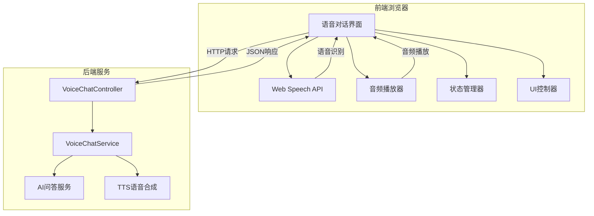
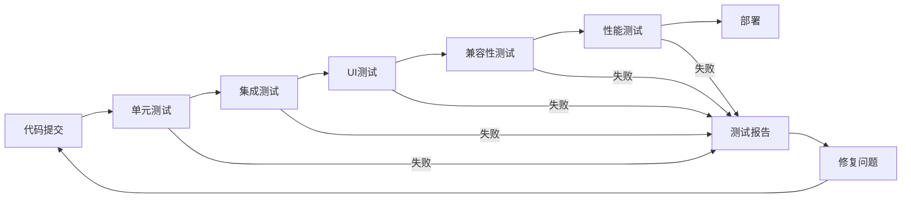

# Design Document

## Overview

语音对话界面是一个基于Web技术的前端应用，提供完整的语音交互体验。系统集成了浏览器原生的Web Speech API进行语音识别，通过RESTful API与后端AI服务通信，并支持语音合成播放AI回答。整个设计遵循现代Web应用的最佳实践，确保跨浏览器兼容性和良好的用户体验。

## Architecture

### 系统架构图



### 技术栈

- **前端技术**: HTML5, CSS3, Vanilla JavaScript
- **语音识别**: Web Speech API (webkitSpeechRecognition/SpeechRecognition)
- **音频处理**: HTML5 Audio API, Web Audio API
- **网络通信**: Fetch API
- **UI框架**: 原生DOM操作
- **响应式设计**: CSS Media Queries

### 架构特点

1. **单页面应用**: 所有功能集成在一个HTML页面中
2. **事件驱动**: 基于用户交互和语音事件的响应式架构
3. **状态管理**: 集中式状态管理，确保UI与业务逻辑同步
4. **错误处理**: 多层次错误处理和用户友好的错误提示
5. **兼容性**: 支持主流浏览器的语音功能

## Components and Interfaces

### 核心组件

#### 1. VoiceChatInterface (主界面组件)
```javascript
class VoiceChatInterface {
    constructor() {
        this.state = 'idle'; // idle, recording, processing, speaking
        this.sessionId = generateSessionId();
        this.speechRecognition = null;
        this.currentAudio = null;
    }
    
    // 初始化组件
    initialize()
    
    // 渲染界面
    render()
    
    // 处理用户交互
    handleUserInteraction(event)
}
```

#### 2. SpeechRecognitionManager (语音识别管理器)
```javascript
class SpeechRecognitionManager {
    constructor(config) {
        this.recognition = null;
        this.isRecording = false;
        this.config = config;
    }
    
    // 初始化语音识别
    initialize()
    
    // 开始录音
    startRecording()
    
    // 停止录音
    stopRecording()
    
    // 处理识别结果
    handleRecognitionResult(event)
    
    // 处理识别错误
    handleRecognitionError(event)
}
```

#### 3. AudioManager (音频管理器)
```javascript
class AudioManager {
    constructor() {
        this.currentAudio = null;
        this.isPlaying = false;
    }
    
    // 播放音频数据
    playAudioData(audioData)
    
    // 播放文本语音
    speakText(text)
    
    // 停止播放
    stopPlayback()
    
    // 音频事件处理
    handleAudioEvents()
}
```

#### 4. ApiClient (API客户端)
```javascript
class ApiClient {
    constructor(baseUrl) {
        this.baseUrl = baseUrl;
    }
    
    // 发送语音对话请求
    async sendVoiceChat(request)
    
    // 获取语音合成
    async synthesizeVoice(request)
    
    // 错误处理
    handleApiError(error)
}
```

#### 5. StateManager (状态管理器)
```javascript
class StateManager {
    constructor() {
        this.currentState = 'idle';
        this.listeners = [];
    }
    
    // 更新状态
    setState(newState, data)
    
    // 订阅状态变化
    subscribe(listener)
    
    // 获取当前状态
    getState()
}
```

#### 6. UIController (UI控制器)
```javascript
class UIController {
    constructor(elements) {
        this.elements = elements;
    }
    
    // 更新UI状态
    updateUI(state, message)
    
    // 显示消息
    addMessage(sender, content)
    
    // 显示状态指示器
    showStatusIndicator(type, message)
    
    // 处理按钮状态
    updateButtonStates(state)
}
```

### 接口定义

#### 后端API接口

##### 1. 语音对话接口
```typescript
// 请求接口
interface VoiceChatRequest {
    sessionId: string;      // 会话ID
    question: string;       // 用户问题
}

// 响应接口
interface VoiceChatResponse {
    answer: string;         // AI回答
    sessionId: string;      // 会话ID
    status: string;         // 状态: SUCCESS, ERROR
    timestamp: string;      // 响应时间戳
}
```

##### 2. 语音合成接口
```typescript
// 请求接口
interface VoiceSynthesisRequest {
    sessionId: string;      // 会话ID
    text: string;          // 要合成的文本
}

// 响应: 二进制音频数据 (audio/wav)
```

##### 3. 会话管理接口
```typescript
// 创建会话请求
interface CreateSessionRequest {
    // 可选的初始化参数
}

// 创建会话响应
interface CreateSessionResponse {
    sessionId: string;      // 新创建的会话ID
    status: string;         // 状态: SUCCESS, ERROR
    createdAt: string;      // 创建时间
}
```

#### 前端事件接口

##### 1. 语音识别事件
```typescript
interface SpeechRecognitionEvents {
    onStart: () => void;
    onResult: (transcript: string, isFinal: boolean) => void;
    onError: (error: SpeechRecognitionError) => void;
    onEnd: () => void;
}
```

##### 2. 音频播放事件
```typescript
interface AudioPlaybackEvents {
    onPlay: () => void;
    onPause: () => void;
    onEnded: () => void;
    onError: (error: MediaError) => void;
}
```

## Data Models

### 前端数据模型

#### 1. 应用状态模型
```typescript
interface AppState {
    currentState: 'idle' | 'recording' | 'processing' | 'speaking';
    sessionId: string;
    isRecording: boolean;
    isProcessing: boolean;
    isSpeaking: boolean;
    lastError: string | null;
    conversationHistory: Message[];
}
```

#### 2. 消息模型
```typescript
interface Message {
    id: string;
    sender: 'user' | 'ai' | 'system';
    content: string;
    timestamp: Date;
    type: 'text' | 'audio' | 'error';
}
```

#### 3. 语音识别配置模型
```typescript
interface SpeechRecognitionConfig {
    language: string;           // 'zh-CN'
    continuous: boolean;        // false
    interimResults: boolean;    // true
    maxAlternatives: number;    // 1
    timeout: number;           // 30000ms
}
```

#### 4. 音频配置模型
```typescript
interface AudioConfig {
    autoPlay: boolean;         // true
    volume: number;           // 1.0
    playbackRate: number;     // 1.0
    fallbackToTTS: boolean;   // true
}
```

### 后端数据交互模型

#### 1. API请求状态
```typescript
interface ApiRequestState {
    isLoading: boolean;
    error: string | null;
    retryCount: number;
    lastRequestTime: Date;
}
```

#### 2. 会话上下文
```typescript
interface SessionContext {
    sessionId: string;
    startTime: Date;
    messageCount: number;
    lastActivity: Date;
}
```

## Error Handling

### 错误分类和处理策略

#### 1. 语音识别错误
```typescript
enum SpeechRecognitionErrorType {
    NO_SPEECH = 'no-speech',           // 未检测到语音
    AUDIO_CAPTURE = 'audio-capture',   // 无法访问麦克风
    NOT_ALLOWED = 'not-allowed',       // 权限被拒绝
    NETWORK = 'network',               // 网络错误
    SERVICE_NOT_ALLOWED = 'service-not-allowed', // 服务不可用
    BAD_GRAMMAR = 'bad-grammar',       // 语法错误
    LANGUAGE_NOT_SUPPORTED = 'language-not-supported' // 语言不支持
}

// 错误处理策略
const errorHandlingStrategies = {
    [SpeechRecognitionErrorType.NO_SPEECH]: {
        message: '未检测到语音，请重试',
        action: 'retry',
        autoRetry: false
    },
    [SpeechRecognitionErrorType.NOT_ALLOWED]: {
        message: '请允许访问麦克风权限',
        action: 'requestPermission',
        autoRetry: false
    },
    [SpeechRecognitionErrorType.NETWORK]: {
        message: '网络连接异常，请检查网络',
        action: 'retry',
        autoRetry: true,
        maxRetries: 3
    }
};
```

#### 2. 网络请求错误
```typescript
enum NetworkErrorType {
    TIMEOUT = 'timeout',
    CONNECTION_ERROR = 'connection',
    SERVER_ERROR = 'server',
    PARSE_ERROR = 'parse'
}

// 重试策略
interface RetryStrategy {
    maxRetries: number;
    backoffMultiplier: number;
    initialDelay: number;
    maxDelay: number;
}

const defaultRetryStrategy: RetryStrategy = {
    maxRetries: 3,
    backoffMultiplier: 2,
    initialDelay: 1000,
    maxDelay: 10000
};
```

#### 3. 音频播放错误
```typescript
enum AudioErrorType {
    DECODE_ERROR = 'decode',
    NETWORK_ERROR = 'network',
    SRC_NOT_SUPPORTED = 'src_not_supported'
}

// 降级策略
const audioFallbackStrategy = {
    [AudioErrorType.DECODE_ERROR]: 'useBrowserTTS',
    [AudioErrorType.NETWORK_ERROR]: 'retry',
    [AudioErrorType.SRC_NOT_SUPPORTED]: 'useBrowserTTS'
};
```

### 全局错误处理机制

```typescript
class ErrorHandler {
    private errorQueue: Error[] = [];
    private maxQueueSize = 10;
    
    // 处理错误
    handleError(error: Error, context: string) {
        this.logError(error, context);
        this.showUserFriendlyMessage(error);
        this.addToQueue(error);
        this.reportError(error, context);
    }
    
    // 显示用户友好的错误信息
    private showUserFriendlyMessage(error: Error) {
        const userMessage = this.getUserFriendlyMessage(error);
        this.uiController.showErrorMessage(userMessage);
    }
    
    // 错误恢复
    attemptRecovery(error: Error): boolean {
        // 实现错误恢复逻辑
        return false;
    }
}
```

## Testing Strategy

### 测试层次

#### 1. 单元测试
- **语音识别管理器测试**: 测试语音识别的启动、停止、结果处理
- **音频管理器测试**: 测试音频播放、暂停、错误处理
- **API客户端测试**: 测试网络请求、响应处理、错误处理
- **状态管理器测试**: 测试状态变更、事件通知

#### 2. 集成测试
- **语音到文本流程测试**: 端到端测试语音识别流程
- **API集成测试**: 测试与后端服务的集成
- **音频播放集成测试**: 测试音频数据的播放流程

#### 3. 用户界面测试
- **交互测试**: 测试按钮点击、状态变化
- **响应式测试**: 测试不同屏幕尺寸下的布局
- **可访问性测试**: 测试键盘导航、屏幕阅读器支持

#### 4. 兼容性测试
- **浏览器兼容性**: Chrome, Firefox, Safari, Edge
- **设备兼容性**: 桌面、平板、手机
- **操作系统兼容性**: Windows, macOS, iOS, Android

### 测试工具和框架

```typescript
// 测试配置
interface TestConfig {
    // 单元测试
    unitTest: {
        framework: 'Jest';
        coverage: 90;
        mockStrategy: 'manual';
    };
    
    // 集成测试
    integrationTest: {
        framework: 'Cypress';
        apiMocking: true;
        realDeviceTest: true;
    };
    
    // 性能测试
    performanceTest: {
        tool: 'Lighthouse';
        metrics: ['FCP', 'LCP', 'CLS', 'FID'];
        targets: {
            performance: 90;
            accessibility: 95;
            bestPractices: 90;
            seo: 85;
        };
    };
}
```

### 测试场景

#### 1. 正常流程测试
```typescript
describe('语音对话正常流程', () => {
    test('用户点击语音按钮 -> 开始录音 -> 语音识别 -> 发送请求 -> 播放回答', async () => {
        // 测试完整的语音对话流程
    });
});
```

#### 2. 异常情况测试
```typescript
describe('异常情况处理', () => {
    test('麦克风权限被拒绝时的处理', async () => {
        // 测试权限拒绝的处理
    });
    
    test('网络连接失败时的重试机制', async () => {
        // 测试网络错误的重试
    });
    
    test('语音识别失败时的降级处理', async () => {
        // 测试识别失败的处理
    });
});
```

#### 3. 性能测试
```typescript
describe('性能测试', () => {
    test('页面加载时间应小于2秒', async () => {
        // 测试页面加载性能
    });
    
    test('语音识别响应时间应小于1秒', async () => {
        // 测试语音识别性能
    });
    
    test('音频播放延迟应小于500ms', async () => {
        // 测试音频播放性能
    });
});
```

### 自动化测试流程



## Implementation Notes

### 关键实现要点

#### 1. 语音识别优化
- **静音检测**: 实现智能静音检测，自动结束录音
- **噪音过滤**: 使用Web Audio API进行基础噪音过滤
- **置信度阈值**: 设置合理的识别置信度阈值
- **超时处理**: 设置录音超时时间，避免长时间录音

#### 2. 音频播放优化
- **预加载**: 预加载音频数据，减少播放延迟
- **格式兼容**: 支持多种音频格式，确保兼容性
- **降级策略**: 后端TTS失败时自动降级到浏览器TTS
- **音量控制**: 提供音量调节功能

#### 3. 用户体验优化
- **状态反馈**: 实时显示系统状态和操作反馈
- **加载指示**: 显示加载动画和进度指示
- **错误提示**: 友好的错误提示和恢复建议
- **响应式设计**: 适配不同设备和屏幕尺寸

#### 4. 性能优化
- **资源懒加载**: 按需加载JavaScript模块
- **内存管理**: 及时释放音频资源和事件监听器
- **网络优化**: 使用请求缓存和压缩
- **DOM优化**: 最小化DOM操作，使用文档片段

#### 5. 安全考虑
- **输入验证**: 验证用户输入和API响应
- **XSS防护**: 防止跨站脚本攻击
- **CSRF防护**: 实现CSRF令牌验证
- **权限管理**: 合理请求和使用浏览器权限

### 新后端接口设计

#### 需要创建的新接口

##### 1. VoiceChatController
```java
@RestController
@RequestMapping("/api/voice-chat")
public class VoiceChatController {
    
    @PostMapping("/ask")
    public Mono<ResponseEntity<VoiceChatResponse>> handleVoiceChat(
            @RequestBody @Valid VoiceChatRequest request) {
        // 处理语音对话请求，不涉及讲课打断功能
        // 直接调用AI服务获取回答
    }
    
    @PostMapping("/synthesize")
    public Mono<ResponseEntity<byte[]>> synthesizeVoice(
            @RequestBody @Valid VoiceSynthesisRequest request) {
        // 将文本转换为语音
    }
    
    @PostMapping("/session/create")
    public Mono<ResponseEntity<CreateSessionResponse>> createSession() {
        // 创建新的对话会话
    }
}
```

##### 2. VoiceChatService
```java
@Service
public class VoiceChatService {
    
    public Mono<String> processVoiceChat(String sessionId, String question) {
        // 处理语音对话逻辑
        // 调用AI服务获取回答
        // 不涉及讲课相关的上下文处理
    }
    
    public Mono<byte[]> synthesizeVoiceAudio(String text) {
        // 语音合成服务
    }
    
    public String createNewSession() {
        // 创建新会话
    }
}
```

##### 3. 数据传输对象
```java
// VoiceChatRequest.java
@Data
public class VoiceChatRequest {
    @NotBlank(message = "会话ID不能为空")
    private String sessionId;
    
    @NotBlank(message = "问题不能为空")
    private String question;
}

// VoiceChatResponse.java
@Data
@AllArgsConstructor
public class VoiceChatResponse {
    private String answer;
    private String sessionId;
    private String status;
    private String timestamp;
}

// VoiceSynthesisRequest.java
@Data
public class VoiceSynthesisRequest {
    @NotBlank(message = "会话ID不能为空")
    private String sessionId;
    
    @NotBlank(message = "文本不能为空")
    private String text;
}
```

#### 与handleTextInterruption的区别

| 特性 | handleTextInterruption | 新的语音对话接口 |
|------|----------------------|-----------------|
| 功能范围 | 讲课打断 + AI对话 | 纯AI对话 |
| 请求参数 | sessionId, question, currentSegment, segmentText | sessionId, question |
| 上下文处理 | 需要处理讲课上下文和片段信息 | 只处理对话上下文 |
| 播放控制 | 需要暂停/恢复讲课播放 | 无播放控制逻辑 |
| 会话管理 | 与讲课会话绑定 | 独立的对话会话 |
| 响应内容 | 包含片段索引等讲课相关信息 | 只包含AI回答和基本信息 |

### 技术难点和解决方案

#### 1. 跨浏览器兼容性
**问题**: 不同浏览器的Web Speech API实现差异
**解决方案**: 
- 特性检测和降级处理
- 统一的API封装层
- 浏览器特定的优化

#### 2. 移动端适配
**问题**: 移动设备的语音识别和音频播放限制
**解决方案**:
- 触摸事件优化
- 自动播放策略
- 移动端特定的UI调整

#### 3. 网络不稳定处理
**问题**: 网络波动影响语音识别和API调用
**解决方案**:
- 智能重试机制
- 离线缓存策略
- 网络状态监测

#### 4. 实时性能要求
**问题**: 语音识别和音频播放的实时性要求
**解决方案**:
- 流式处理
- 预加载和缓存
- 异步处理优化